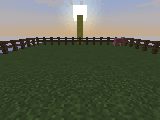
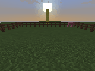
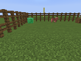
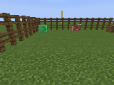
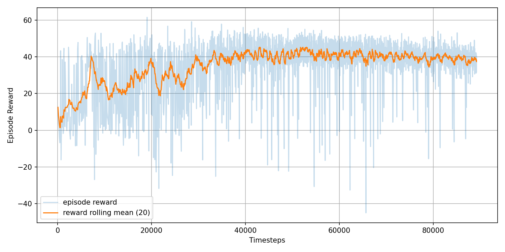
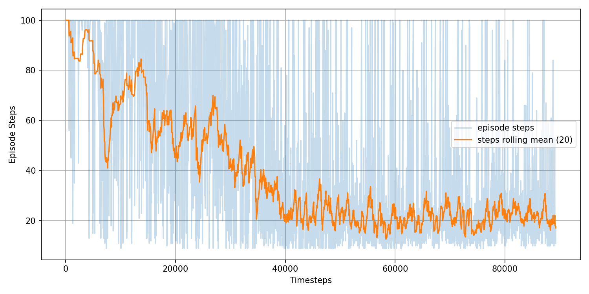

# CS175-Minecraft

Running Minecraft simulation using [`MalmoEnv`](https://github.com/Microsoft/malmo/tree/master/MalmoEnv)

---

## Java Requirements (Windows)

### 1. Install Java8 JDK ([AdoptOpenJDK](https://adoptopenjdk.net/))

### 2. Set `JAVA_HOME` and add to `PATH`

* Create new **Environment Variables** `JAVA_HOME` with your JDK path (e.g. `C:\program Files\Eclipse Adoptium\jdk-8\`)

* Add path `<your JDK path>\bin` to system system `PATH` variable

### 3. Verify

Make sure `java -version` shows the correct version in `cmd`

---

## Getting Started

### 1. Create virtual environment (~python3.9) and git clone this repo

### 2. Install dependencies

```bash
pip install malmoenv gymnasium numpy pillow lxml stable-baselines3 imageio matplotlib pandas transformers sentence-transformers
```
You might need to install GPU-compatible versions of `torch` if you wanna use GPU for training, current default uses CPU

### 3. Download MalmoPlatform

From the root directory (of this repo), run:

```bash
python -c "import malmoenv.bootstrap; malmoenv.bootstrap.download()"
```


### 4. Run Minecraft

Start a new instance of Minecraft

```bash
python -c "import malmoenv.bootstrap; malmoenv.bootstrap.launch_minecraft(9000)"
```

### 5. Run sample missions

Start a new terminal and  run:
```bash
python sample_scripts/run.py --mission sample_missions/mobchase_single_agent.xml
```

The original sample scripts and missions are located in `MalmoPlatform/MalmoEnv/` and `MalmoPlatform/MalmoEnv/Missions`

---


## Training PPO Agent
### Example training command
```bash
python -u train/train_ppo.py --mission missions/multi_target_single_agent.xml --episodemaxsteps 100 --total-timesteps 150000 --model-path ppo_logs/out1/ --task-py train/tasks/multi_target_navigation.py --projection > ppo_logs/out1/out.txt
```

`--mission` is the mission.xml file

`--episodemaxsteps` is the max steps the agent can take per episode

`--timesteps` is the total number of steps the agent will take during the entire training. Currently set to 100000 as a safe upperbound. Single target tasks like `mob_chase` will usually require less thank 50k timesteps to train, so just end training early as needed

`--model-path` is the path where the trained models and logs will be saved

`--task-py` is an additional (and required) custom task file that handles building state and shapping reward. See `train/tasks/mob_chase.py` or `multi_target_navigation` for examples

For multi-target tasks:

`--projection` is an optional argument for enabling the projection layer that projects the text instruction through trainable MLP instead of passing the raw encoded embedding into the PPO network

`--random` is an optinal argument for enabling randomized mission xml generation per episode. Need to define function `make_random_mission_xml` in task-py and add `<MissionQuitCommands/>` under `<AgentHandlers>` in your mission xml. See `multi_target_break_blocks.py` for examples

`--load-model` loads an existing checkpoint and continues to train on top

PPO model arguments default:

`--lr`: 3e-4

`--n-steps`: 512

`--batch-size`: 64

`--gamma`: 0.99

`--ent-coef`: 0.01

## Evaluating PPO Agent
### Example evaluation command

```bash
python train/train_ppo.py --mission missions/multi_target_single_agent.xml --episodemaxsteps 100 --task-py train/tasks/multi_target_navigation.py --model-path ppo_logs/out13/ppo_65000_steps.zip --projection --eval --episodes 5 --instruction "go to the pig" 
```

`--mission`, `--task-py`, and `--episodemaxsteps` are the same as training

`--model-path` need to be exact path to a saved checkpoint (.zip)

`--eval` indicates evluation instead of training

`--episodes` is the number of episodes to run for evluation

`--record` optionally records the evluation and saves as GIF

For multi-target tasks:

`--projection` need to be consistent with training

`--random` usually same as training, depends on the mission xml setup

`--instruction` need to pass in the text instruction for multi-target evaluation

---
## Known Issues
### 1. Empty info returned by Malmo
Current RL implementation rely soley on info returned by Malmo for state info such as grid observations. However, Malmo frequently return empty info dict possibly due to Python-Minecraft synchronization issue related to Malmo. The current workaround is simply to return the previous state and skip reward shaping for that step.

*Note that the very first observation info only becomes available after executing the first action/step, so a env.step(0), usually a move forward action depending on your custom action space, is added at the very begining of each reset to obtain the info state.

### 2. Minecraft instance become unresponsive due to per-episode xml reloading implementation
The current per-episode xml reloading works by manually closing and re-initialize current Malmo environment in order to be able to reload a different xml (generated from `make_random_mission_xml` function defined in your task-py file, you decide how to modify the xml) for generalized learning. However, this leads to a weird issue of each step's `terminated=True` or `truncated=True` to not be able to end the episode early, and would have to wait for the Malmo's internal timer `timeLimitMs`, defined in the mission xml, to expire to end the episode. The workaround is to manually send a hidden `quit` action (defined only in Malmo env init, don't ever add it to your custom action space) and tells Malmo to end the episode. However, this again leads to another Python-Minecraft synchronization issue where if the `quit` command is sent too quickly, it would cause the training to end prematurely or cause the Minecraft instance to crash (unresponsive). The "fix" for this issue is to simply add delay for each `quit` command so that the command would reach Malmo before the Python code calls reset. Though the delayed amount might depends on the performance on your machine (like your CPU, allocated RAM for Minecraft, etc.), but I've not done thorough testing on this so I have no idea. Or it might be due to the total number of Malmo env resets.

---

## Missions
### mob_chase.py (single target)
#### Training Command

```bash
python -u train/train_ppo.py --mission missions/mob_chase_single_agent.xml --episodemaxsteps 100 --total-timesteps 100000 --model-path ppo_logs/out1/ --task-py train/tasks/mob_chase.py > ppo_logs/out1/out.txt
```
#### Evaluation Command

```bash
python train/train_ppo.py --mission missions/mob_chase_single_agent.xml --episodemaxsteps 100 --task-py train/tasks/mob_chase.py --model-path ppo_logs/out1/ppo_final.zip --task-py train/tasks/mob_chase.py --eval --episodes 5
```

#### Example Recording



---

### multi_target_navigation.py (multi-target, fixed layout)
#### Training Command

```bash
python -u train/train_ppo.py --mission missions/multi_target_single_agent.xml --episodemaxsteps 100 --total-timesteps 150000 --model-path ppo_logs/out1/ --task-py train/tasks/multi_target_navigation.py --projection > ppo_logs/out1/out.txt
```

#### Evaluation Command

```bash
python train/train_ppo.py --mission missions/multi_target_single_agent.xml --episodemaxsteps 100 --task-py train/tasks/multi_target_navigation.py --model-path ppo_logs/out13/ppo_65000_steps.zip --projection --eval --episodes 5 --instruction "go to the pig" 
```

#### Example Recording

|"go to the pig"|"go to the log"|"go to the emerald"|
| -------- | -------- | -------- |
||||

#### Example learning plot




This run was from the "Add obstacle states" commit. The best model appears to be the 57500_steps checkpoint, and the learning started to drift away after that

---

### multi_target_break_blocks.py (multi-target, shuffled layout)
#### Training Command
The per-episode xml reloading implementation causes Malmo to lag early or even crash during long runs. It's recommended to only run up to 175k (or even fewer) steps, and restart Malmo and continue from the previous checkpoint.

Run 1:
```bash
python -u train/train_ppo.py --mission missions/multi_target_break_blocks_single_agent.xml --episodemaxsteps 125 --total-timesteps 175000 --model-path ppo_logs_break_blocks/out20/ --task-py train/tasks/multi_target_break_blocks.py --projection --random --lr 3e-4 --n-steps 2048 --batch-size 128 > ppo_logs_break_blocks/out20/out.txt 2>&1
```

Run 2, fine-tune from the 175k checkpoint:
- (required) In task-py manaully set `self.current_episode` to however many episode completed in the previous run (check # rows in monitor.csv)
- `--n-steps` reduce from 2048 -> 1024
- `--lr` reduce from 3e-4 to 1e-4

```bash
python -u train/train_ppo.py --mission missions/multi_target_break_blocks_single_agent.xml --episodemaxsteps 125 --total-timesteps 175000 --model-path ppo_logs_break_blocks/out20_cont/ --task-py train/tasks/multi_target_break_blocks.py --load-model ppo_logs_break_blocks/out20/ppo_175000_steps.zip --projection --random --lr 3e-4 --n-steps 1024 --batch-size 128 > ppo_logs_break_blocks/out20_cont/out.txt 2>&1
```


#### Evaluation Command

```bash
python train/train_ppo.py --mission missions/multi_target_break_blocks_single_agent.xml --episodemaxsteps 50 --task-py train/tasks/multi_target_break_blocks.py --model-path ppo_logs_break_blocks/out19/ppo_150000_steps.zip --projection --random --eval --episodes 5 --instruction "break the diamond ore" 
```

---

## Training DQN Agent

`train_dqn.py` still have issues and not properly learning, only use it as a reference

```bash
python train/train_dqn.py --mission missions/reach_target_single_agent.xml --task train/tasks/mob_chase.py --episodes 700 --episodemaxsteps 100 --model-path q_model
```

## Evaluating DQN Agent

```bash
python train/train_dqn.py --mission missions/reach_target_single_agent.xml --eval --task train/tasks/mob_chase.py --episodes 5 --episodemaxsteps 100 --model-path q_model
```

---

## Miscellaneous

To change Minecraft memory allocation, go to the downloaded `MalmoPlatform/Minecraft/build.gradle`, locate the `exec.jvmArgs` on line 51, and change the `"-Xmx2G"` value to whatever (e.g. `"-Xmx4G"` for 4GB of memory)
