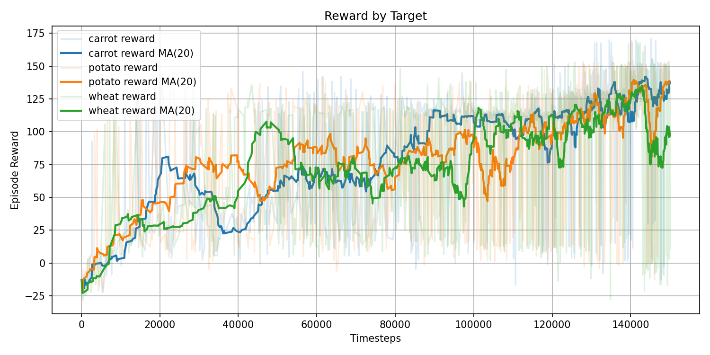
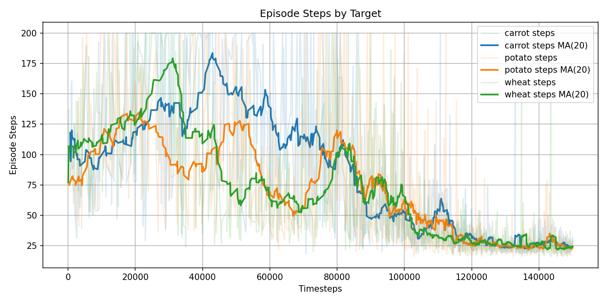
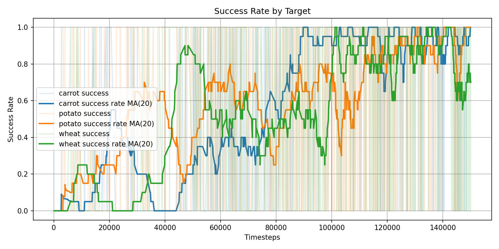
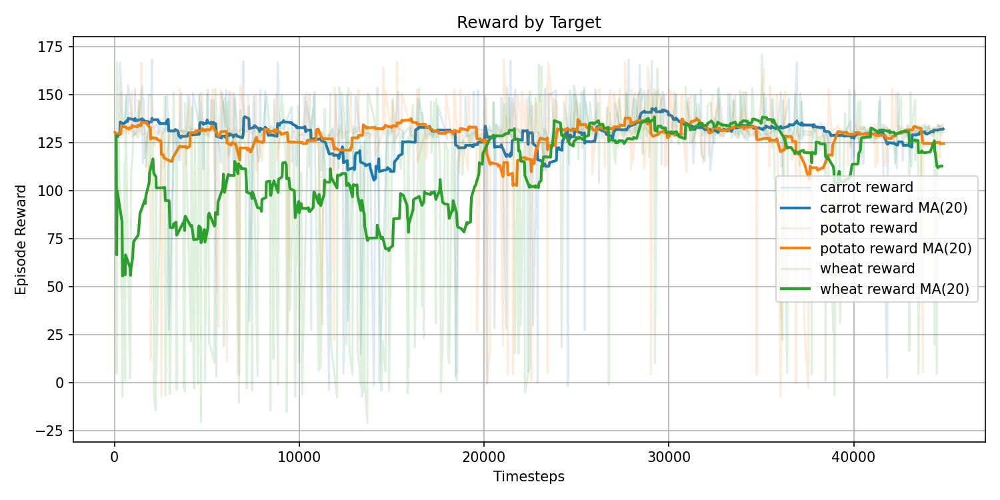
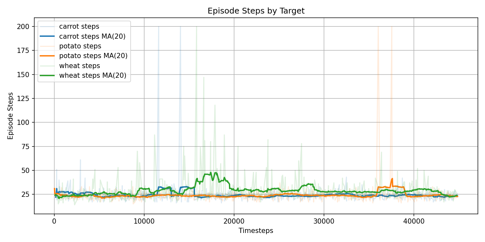
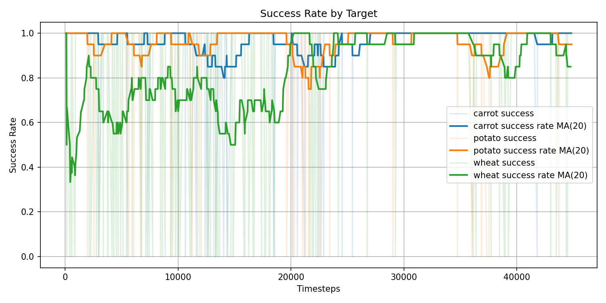
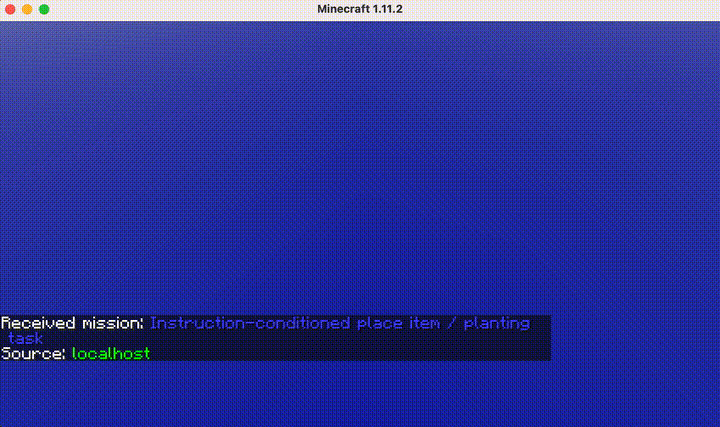
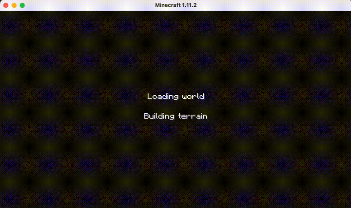

# CS175-Minecraft

Running Minecraft simulation using [`MalmoEnv`](https://github.com/Microsoft/malmo/tree/master/MalmoEnv)

---

## Java Requirements (Windows)

### 1. Install Java8 JDK ([AdoptOpenJDK](https://adoptopenjdk.net/))

### 2. Set `JAVA_HOME` and add to `PATH`

* Create new **Environment Variables** `JAVA_HOME` with your JDK path (e.g. `C:\program Files\Eclipse Adoptium\jdk-8\`)

* Add path `<your JDK path>\bin` to system system `PATH` variable

### 3. Verify

Make sure `java -version` shows the correct version in `cmd`

---

## Getting Started

### 1. Create virtual environment (~python3.9) and git clone this repo

### 2. Install dependencies

```bash
pip install malmoenv gymnasium numpy pillow lxml stable-baselines3 imageio matplotlib pandas transformers sentence-transformers
```
You might need to install GPU-compatible versions of `torch` if you wanna use GPU for training, current default uses CPU

### 3. Download MalmoPlatform

From the root directory (of this repo), run:

```bash
python -c "import malmoenv.bootstrap; malmoenv.bootstrap.download()"
```


### 4. Run Minecraft

Start a new instance of Minecraft

```bash
python -c "import malmoenv.bootstrap; malmoenv.bootstrap.launch_minecraft(9000)"
```

### 5. Run sample missions

Start a new terminal and  run:
```bash
python sample_scripts/run.py --mission sample_missions/mobchase_single_agent.xml
```

The original sample scripts and missions are located in `MalmoPlatform/MalmoEnv/` and `MalmoPlatform/MalmoEnv/Missions`

---


## Training PPO Agent
### Example training command

```bash
python -u train/train_ppo.py   --mission missions/place_item/place_item_farm_single_agent.xml   --episodemaxsteps 200   --total-timesteps 150000   --model-path ppo_logs/place_item_test/random_target/   --task-py train/tasks/place_item_farming.py   --projection   > ppo_logs/place_item_test/random_target/out.txt
```
`--mission` is the mission.xml file

`--episodemaxsteps` is the max steps the agent can take per episode

`--timesteps` is the total number of steps the agent will take during the entire training. Currently set to 100000 as a safe upperbound. Single target tasks like `mob_chase` will usually require less thank 50k timesteps to train, so just end training early as needed

`--model-path` is the path where the trained models and logs will be saved

`--task-py` is an additional (and required) custom task file that handles building state and shapping reward. See `train/tasks/mob_chase.py` as an example

`--resume-from` loads an existing checkpoint and continues to train on top

## Evaluating PPO Agent
### Example evaluation command

```bash
python train/train_ppo.py --mission missions/mob_chase_single_agent.xml --episodemaxsteps 100 --task-py train/tasks/mob_chase.py --model-path ppo_logs/out1/ppo_final.zip --task-py train/tasks/mob_chase.py --eval --episodes 5
```

`--mission`, `--task-py`, and `--episodemaxsteps 100` are the same as training

`--model-path` need to be exact path to a saved checkpoint (.zip)

`--eval` indicates evluation instead of training

`--episodes` is the number of episodes to run for evluation

`--record` optionally records the evluation and saves as GIF

---
## Known Issues
### 1. Empty info returned by Malmo
Current RL implementation rely soley on info returned by Malmo for state info such as grid observations. However, Malmo frequently return empty info dict possibly due to Python-Minecraft synchronization issue related to Malmo. The current workaround is simply to return the previous state and skip reward shaping for that step.

*Note that the very first observation info only becomes available after executing the first action/step, so a env.step(0), usually a move forward action depending on your custom action space, is added at the very begining of each reset to obtain the info state.


---

## Missions
### place_item_farming.py (multi-target)
#### Training Command
The per-episode xml reloading implementation causes Malmo to lag early or even crash during long runs. It's recommended to only run up to 200k (or even fewer) steps, depending on number of episodes/resets, and restart Malmo and continue from the previous checkpoint.

Run 1:
```bash
python -u train/train_ppo.py   --mission missions/place_item/place_item_farm_single_agent.xml   --episodemaxsteps 200   --total-timesteps 150000   --model-path ppo_logs/place_item_test/random_target/   --task-py train/tasks/place_item_farming.py  --projection   > ppo_logs/place_item_test/random_target/out.txt
```

Run 2, continue from the 100k checkpoint:

```bash
python -u train/train_ppo.py --mission missions/place_item/place_item_farm_single_agent.xml --episodemaxsteps 200 --total-timesteps 50000 --model-path ppo_logs/place_item_test/continue_to_200k/ --resume-from ppo_logs/place_item_test/random_target/ppo_final.zip --task-py train/tasks/place_item_farming.py --projection > ppo_logs/place_item_test/continue_to_200k/out.txt
```

#### Evaluation Command

```bash
python train/train_ppo.py --mission missions/place_item/place_item_farm_single_agent.xml --episodemaxsteps 200 --task-py train/tasks/place_item_farming.py --model-path ppo_logs/place_item_test/continue_to_200k/ppo_final.zip --projection --eval --episodes 5 --instruction "grow potato" 
```
#### Learning plot

##### Up to 150k




##### 150k to 200k


v

#### Recording
1. PPO Sentence Transformer Model
|potato|wheat|carrot|
| -------- | -------- | -------- |
||||


---

## Training DQN Agent

`train_dqn.py` still have issues and not properly learning, only use it as a reference

```bash
python train/train_dqn.py --mission missions/reach_target_single_agent.xml --task train/tasks/mob_chase.py --episodes 700 --episodemaxsteps 100 --model-path q_model
```

## Evaluating DQN Agent

```bash
python train/train_dqn.py --mission missions/reach_target_single_agent.xml --eval --task train/tasks/mob_chase.py --episodes 5 --episodemaxsteps 100 --model-path q_model
```

---

## Miscellaneous

To change Minecraft memory allocation, go to the downloaded `MalmoPlatform/Minecraft/build.gradle`, locate the `exec.jvmArgs` on line 51, and change the `"-Xmx2G"` value to whatever (e.g. `"-Xmx4G"` for 4GB of memory)


## Personal command for farming:

create virtual environment:

conda activate malmo


change java version:
export JAVA_HOME=$(/usr/libexec/java_home -v 1.8)
export PATH="$JAVA_HOME/bin:$PATH"

run training:
python -u train/train_ppo.py   --mission missions/place_item/place_item_farm_single_agent.xml   --episodemaxsteps 200   --total-timesteps 50000   --model-path ppo_logs/place_item_test/base_potato/   --task-py train/tasks/place_item_farming_single_target.py   --projection   > ppo_logs/place_item_test/base_potato/out.txt

random target:
python -u train/train_ppo.py   --mission missions/place_item/place_item_farm_single_agent.xml   --episodemaxsteps 200   --total-timesteps 150000   --model-path ppo_logs/place_item_test/random_target/   --task-py train/tasks/place_item_farming.py   --projection   > ppo_logs/place_item_test/random_target/out.txt

continue training
python -u train/train_ppo.py \
  --mission missions/place_item/place_item_farm_single_agent.xml \
  --episodemaxsteps 200 \
  --total-timesteps 50000 \
  --model-path ppo_logs/place_item_test/continue_to_200k/ \
  --resume-from ppo_logs/place_item_test/random_target/ppo_final.zip \
  --task-py train/tasks/place_item_farming.py \
  --projection \
  > ppo_logs/place_item_test/continue_to_200k/out.txt

eval:
python train/train_ppo.py --mission missions/place_item/place_item_farm_single_agent.xml --episodemaxsteps 200 --task-py train/tasks/place_item_farming.py --model-path final_model/plant_farming/ppo_182516_steps.zip --projection --eval --episodes 5 --instruction "place the carrot seed" 

ffmpeg -i "QQ20260609-042459-HD.mp4" -vf "fps=12,scale=720:-1:flags=lanczos" "minecraft_record.gif"
